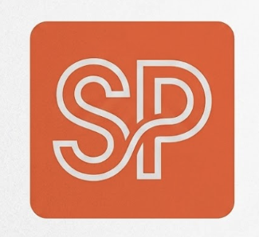
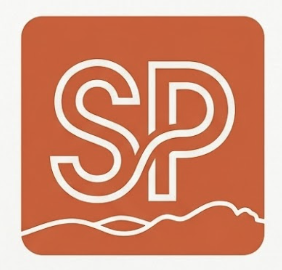
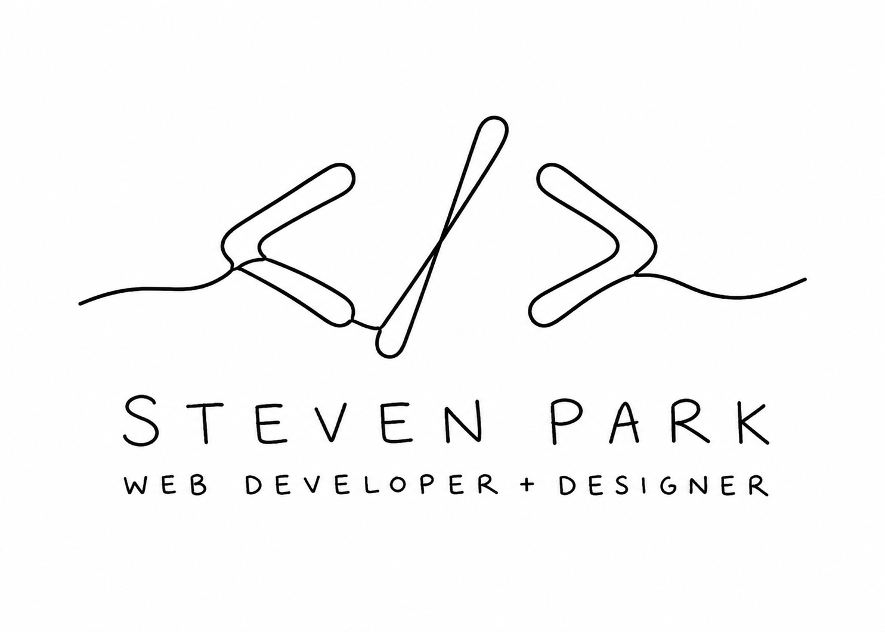
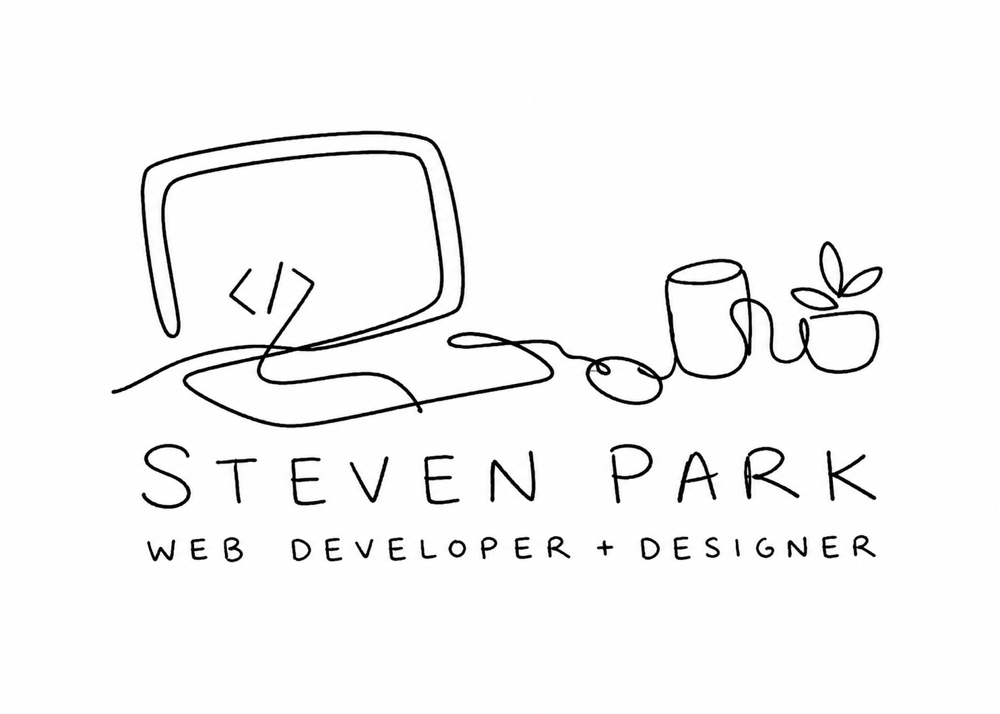

# Redesign

Notes, decisions and shortlists for the personal site rebuild — as distinct from `Scratchpad.md`'s general tool/link cataloguing.

---

## Typography

### Font Shortlist

#### Google Fonts

- **Space Grotesk** — grotesque with distinctive proportions, geometric personality. [[Google Fonts]](https://fonts.google.com/specimen/Space+Grotesk)
- **Work Sans** — grotesque optimised for on-screen text, wide weight range. [[Google Fonts]](https://fonts.google.com/specimen/Work+Sans)
- **DM Sans** — low-contrast geometric sans, tight letterspacing. [[Google Fonts]](https://fonts.google.com/specimen/DM+Sans)
- **Open Sans** — humanist sans, widely used, extensive language support. [[Google Fonts]](https://fonts.google.com/specimen/Open+Sans)
- **Playfair Display** — high-contrast display serif, transitional style, good for headings. [[Google Fonts]](https://fonts.google.com/specimen/Playfair+Display)
- **Quicksand** — rounded geometric sans, display/heading weight. [[Google Fonts]](https://fonts.google.com/specimen/Quicksand)
- **PT Mono** — monospace, fixed-width, good for code snippets. [[Google Fonts]](https://fonts.google.com/specimen/PT+Mono)
- **Arvo** — geometric slab serif, even stroke weights. [[Google Fonts]](https://fonts.google.com/specimen/Arvo)
- **Quando** — serif with quirky, rounded detailing, single-weight display face. [[Google Fonts]](https://fonts.google.com/specimen/Quando)
- **Bitter** — contemporary slab serif, designed for text-heavy screen reading. [[Google Fonts]](https://fonts.google.com/specimen/Bitter)

#### Non-Google

- **Inter** — grotesque sans, designed for UI legibility at small sizes. [[rsms.me]](https://rsms.me/inter/)
- **Satoshi** — contemporary grotesque, variable font. [[Fontshare]](https://www.fontshare.com/fonts/satoshi)
- **Supreme** — grotesque with rounded terminals. [[Fontshare]](https://www.fontshare.com/fonts/supreme)
- **Switzer** — neutral grotesque, variable font. [[Fontshare]](https://www.fontshare.com/fonts/switzer)
- **Wellcome** — humanist sans designed for Wellcome Trust/Wellcome Collection, released open source. [[GitHub]](https://github.com/wellcometrust/fonts)
- **Caviar Dreams** — casual hand-drawn-style sans serif, free for personal and commercial use. [[Font Squirrel]](https://www.fontsquirrel.com/fonts/caviar-dreams)

#### Misc/Decorative

- **Mattilda** — handwritten script font. [[dafont.com]](https://www.dafont.com/mattilda.font?l%5B%5D=10&l%5B%5D=1)
- **The Playlist** — bold decorative display font, free for personal use. [[freedesignresources.net]](https://freedesignresources.net/the-playlist-free-font/)
- **SignPainter HouseScript** — hand-lettered sign-painter script, casual and expressive. [[fontsgeek.com]](https://fontsgeek.com/fonts/SignPainter-HouseScript-Regular)

### Resources

- **Practical Typography** — Matthew Butterick (MB Type founder, also wrote Typography for Lawyers, built the Pollen publishing software this site runs on). Canonical, still-updated reference (2024 entries visible) covering the actual reasoning behind type choices — font pairing, line length, hierarchy — not just a web-CSS cheat sheet; also covers print/PDF/Word. Worth reading before finalising the font shortlist above, not just cataloguing. [[practicaltypography.com]](https://practicaltypography.com/)

## Logo/Branding

| | | | |
|---|---|---|---|
|  |  |  |  |

## Design Inspiration

Full-page screenshots collected over the years (`docs/cool-designs/`), catalogued for the rebuild.

#### Bold / Colour-Blocked

- **Southbank Centre — Events Listing** — Punchy solid-yellow background with huge black serif display type and red accent buttons for a London arts venue's what's-on page. [[filename]](cool-designs/Untitled%2022.png)
- **Southbank Centre — Visitor Info** — Same yellow color-blocked system applied to an accordion-style FAQ/info page with white card modules. [[filename]](cool-designs/Untitled%2023.png)
- **Royal Opera House — The Cellist** — Oversized black condensed display type labels ("Synopsis," "Cast," "Access") divide teal and blush-pink color-blocked sections beneath a moody performance photo. [[filename]](cool-designs/Untitled%209.png)
- **Happy Cog — Bold Slab-Serif Statement** — A single giant black slab-serif headline ("Beware the trendy pitch") dominates a plain white agency homepage with a gear-shaped logo mark. [[filename]](cool-designs/screencapture-happycog-com.png)
- **Themes Kingdom — Coral Marketplace** — Coral/salmon hero with a large microscope photo and bold condensed white type, backed by dark and pastel-blue trust sections for a WordPress theme shop. [[filename]](cool-designs/themes-kingdom.png)
- **Tictoc — Multi-Colour Stats Blocks** — A digital agency site stacking full-bleed green, magenta and orange sections, each with big circular stat charts and pin-style icon rows. [[filename]](cool-designs/tictocfamily-com.png)
- **CSS Zen Garden — Vertical Colour Panels** — Classic magenta, orange, teal and cream vertical stripes with simple circular line-art icons framing a mid-century house photo. [[filename]](cool-designs/Untitled.png)
- **Escape Glasgow — Maze Pattern Landing** — Bold navy-and-yellow geometric maze background pattern with teal color-blocked sections and circular badge icons for an escape-room business. [[filename]](cool-designs/escape-glasgow-co-uk.png)
- **RxArt — Colourful Nonprofit Magazine** — KAWS-style colourful illustration hero over a Swiss-grid magazine layout with red/blue/green blocks and a bold red donate footer. [[filename]](cool-designs/rxart-net.png)
- **Cotton Bureau — Annotated Terms Page** — A coral header and dark repeating t-shirt-pattern banner top an otherwise plain legal page enlivened by italic "plain English" margin notes. [[filename]](cool-designs/cottonbureau-com.png)

#### Dark Mode

- **A Human Future — Neon Green Studio Site** — Stark black-on-white grotesk headlines with neon-green highlight bars and glitchy AI-generated imagery for a software studio. [[filename]](cool-designs/Untitled%2021.png)
- **BrowserStack — Dark Webinar Series** — Deep navy/purple background with a fine geometric line pattern, coral accent pills and framed video-thumbnail cards for a webinar series. [[filename]](cool-designs/Untitled%207.png)
- **SOS Violence Conjugale — Neon Sticker Campaign** — Near-black background, huge slanted white display type crossed out in red, and scattered neon sticker-style badges for an awareness campaign. [[filename]](cool-designs/Untitled%204.png)
- **Own World — Industrial Product Page** — Weathered dark concrete-texture header with a yellow nav bar over a stark product photo of a wireframe sculpture, e-commerce style. [[filename]](cool-designs/screencapture-www-ownworld-com-au-products-tabid-86-pid-660-cid-342-Water-Buffalo-aspx.png)

#### Illustrated / Playful

- **DrawKit — Illustration Library Grid** — Clean white background with a tidy grid of pastel flat-illustration character cards for a free illustration resource site. [[filename]](cool-designs/Untitled%2019.png)
- **iamsteve — Pastel Illustrated Dev Blog** — Soft mint-and-peach gradient header illustration with orange accent headings for a CSS-shapes tutorial post. [[filename]](cool-designs/Untitled%2015.png)
- **Setapp — Illustrated Listicle Post** — Peach flat-illustration banner atop a straightforward blue/white how-to listicle blog layout. [[filename]](cool-designs/Untitled%2016.png)
- **The Papestielliz — Pastel Character Duo** — Cream background with playful hand-drawn character illustrations of a design duo, arranged around a friendly process-step narrative. [[filename]](cool-designs/screencapture-thepapestielliz-2020-10-03-17_45_53.png)
- **Robb Owen — Line-Art Developer Portrait** — Pale blue background with a purple/teal line-art illustrated self-portrait and open-source project cards for a personal dev site. [[filename]](cool-designs/Untitled%203.png)
- **Flywheel — Sky Illustration Pricing** — Whimsical hand-drawn clouds and sun illustration behind a WordPress hosting pricing-tier comparison table. [[filename]](cool-designs/Untitled%205.png)
- **Wealthsimple — Cactus Editorial Article** — Warm cream background with a single potted-cactus illustration alongside a clean, generously-spaced finance article layout. [[filename]](cool-designs/Untitled%2014.png)
- **Josh Comeau — Colourful Callout Blog** — Light blue background dev blog using distinct coloured callout boxes (green tip, yellow warning, purple note) and a friendly cartoon avatar. [[filename]](cool-designs/Untitled%2024.png)

#### Minimal / Editorial

- **Manuel Matuzovic — Teal-Accented Blog** — Light grey background personal blog using bold teal and red highlight blocks behind post titles instead of borders or cards. [[filename]](cool-designs/Untitled%2012.png)
- **Headscape/Boagworld — Pull-Quote Article** — Restrained black-and-white editorial blog layout with a single bold blue pull-quote box breaking up the body copy. [[filename]](cool-designs/screencapture-boagworld-com-usability-think-know-information-architecture-might-true.png)
- **The Markup — Illustrated News Grid** — Cream/pink background with a bold red serif masthead and recurring flat-illustration thumbnails (envelopes, spreadsheets) across a tech-journalism article index. [[filename]](cool-designs/Untitled%2025.png)
- **Andrew Wang-Hoyer — Mint Doodle Portfolio** — Bright mint-green background filled with black-bordered project cards, each featuring a small hand-drawn doodle icon and bold slab headline. [[filename]](cool-designs/Untitled%2011.png)

#### Product / SaaS Landing Pages

- **Indeglås — Product Catalogue Grid** — Clean navy-and-orange branded site with a tidy filterable grid of architectural glass-partition product photos. [[filename]](cool-designs/Untitled%201.png)
- **Flywheel — Teal Feature Walkthrough** — Solid teal header band leading into dashboard screenshots, a video thumbnail and a simple checkmark feature list. [[filename]](cool-designs/Untitled%206.png)
- **Desktime — Split Teal Hero** — Diagonal split hero pairing bright teal and dark navy panels, followed by circular icon feature tiles for a coworking-space app. [[filename]](cool-designs/desktimeapp-com.png)
- **Holvi — Light Blue Fintech Landing** — Soft pastel-blue and yellow product photography paired with clean pricing cards for a freelancer business-banking app. [[filename]](cool-designs/screencapture-holvi-uk-lp-digital-business-account-business-banking-sea-2020-03-13-10_30_56.png)
- **Invoicely — Navy/Orange SaaS Landing** — Dark navy hero with a desk photo and orange CTA buttons, plus circular line-icon feature callouts for an invoicing tool. [[filename]](cool-designs/screencapture-invoicely-1505242547448.png)
- **Square — Light Blue Payments Landing** — Airy pastel-blue hero of a hand holding a phone and card reader, followed by simple icon-driven feature rows and lifestyle photography. [[filename]](cool-designs/screencapture-squareup-com.png)
- **Kin — Teal/Purple HR SaaS** — Dark photographic hero into a solid-teal intro section, with clean product screenshots and purple accent icons for HR software. [[filename]](cool-designs/kin.png)
- **Bear — Dark UI on Light Grey** — Minimal light-grey marketing page showcasing a dark-mode writing app's UI on layered device mockups, red accent icon system. [[filename]](cool-designs/screencapture-www-bear-writer-com-1469834820657.png)
- **Typeform — Cream Template Landing** — Warm beige background, black CTA buttons and a laptop mockup for a form-template marketing page with simple testimonial cards. [[filename]](cool-designs/screencapture-typeform-templates-t-employee-evaluation-2020-10-03-18_01_40.png)
- **jsPDF/Parallax — Purple Geometric SaaS** — Vivid purple gradient blobs and abstract shapes framing a code-editor screenshot for a developer-tool landing page. [[filename]](cool-designs/Untitled%2013.png)
- **SuperHi — Bold Blue/Yellow Course Landing** — Saturated indigo-blue hero with yellow 3D-object illustrations and card carousels for an online design-course platform. [[filename]](cool-designs/Untitled%2017.png)
- **SuperHi — Yellow Course Detail Page** — Bright yellow-and-red hero with a pencil illustration, blue accent info blocks, and a book product callout for a specific course page. [[filename]](cool-designs/Untitled%2018.png)

#### Portfolio / Agency

- **Indie Labs — Studio Portfolio** — Light blue diagonal-striped hero banner over a dark-card project grid and a headshot-based team section, classic 2010-era studio site. [[filename]](cool-designs/Indie_Labs__Makers_of_Big_Cartel_Pulley__Emptees_1284640881272.png)
- **Bearded — Yellow-Accent Agency Portfolio** — Clean white background with yellow highlight quotes, simple line-icon service tiles and a dark contact-form footer. [[filename]](cool-designs/bearded-com.png)
- **Paper Tiger — Colour-Splash Agency Site** — Plain white background punctuated by a large abstract multi-colour splash graphic behind bold black grotesk headlines and a client-logo grid. [[filename]](cool-designs/Untitled%208.png)
- **Mainly Photography — Scattered Typography Portfolio** — Oversized loose, scattered letterforms forming the studio name over a peach background, followed by a tight photo/branding-work collage grid. [[filename]](cool-designs/Untitled%202.png)
- **The Design Files Open House — Styled Interior Hero** — Full-bleed art-directed interior photography with bold white script-and-sans overlay type, then yellow/purple/blue-grey triangular sponsor sections. [[filename]](cool-designs/thedesignfilesopenhouse-com.png)

#### Misc

- **Pastel Fashion Editorial Grid** — Four-panel pastel colour-blocked fashion photography grid with bold black line-art letterforms (F, H, A, O) overlaid on each model. [[filename]](cool-designs/Screenshot_2020-06-29_at_11.27.41.png)
- **Minimal Yellow Login Button** — A tiny cropped detail shot of a single bordered yellow login button on white — a UI micro-interaction reference rather than a full page. [[filename]](cool-designs/Screenshot_2020-08-14_at_12.42.20.png)
- **Bearded Headshot on Teal Blob** — A simple circular profile headshot of a bearded man set against a rough-edged teal blob shape. [[filename]](cool-designs/Untitled%2020.png)
- **Madrona Labs — Audio Software Showcase** — Warm beige/tan background with overlapping abstract product photography tiles for a boutique audio-synth software company. [[filename]](cool-designs/Untitled%2010.png)
- **Wivina — Green Duotone Real Estate Hero** — Full-bleed architectural interior render tinted in a green duotone overlay, paired with a minimal sidebar nav for a retirement-residence site. [[filename]](cool-designs/wivina-be.jpg)

## Coding Standards

Raw notes and links are captured cross-project in `spark-board`'s scratchpad rather than here, since they should feed a general coding skill/reference too, not just this rebuild: [`spark-board/docs/scratchpad/coding-standards.md`](../../spark-board/docs/scratchpad/coding-standards.md)

Standards that mature and stabilise will get promoted into official `spark-board/docs/` and this project should adopt them once that happens.

## Direction & Decisions

